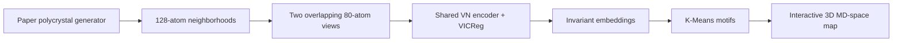

# Self-supervised motif discovery in molecular dynamics

Reference implementation and runnable demonstration for **“Self-Supervised
Rotation-Invariant Representations for Unsupervised Motif Discovery in Molecular
Dynamics”** by Vsevolod Morozov, Emilie Devijver, Charlotte Laclau, Paul Krzakala,
and Noel Jakse.

The method learns clusterable representations of local atomic neighborhoods directly
from coordinates. A rotation-aware Vector Neuron encoder is trained with VICReg on
overlapping views; K-Means then discovers structural motifs without using labels during
representation learning.

[Read the paper](paper/paper.pdf) ·
[Open the executed demonstration](notebooks/synthetic_motif_demo.ipynb)

## Demonstration

The notebook runs the paper pipeline from a synthetic molecular-dynamics box to a
spatial motif map:



It generates an eight-grain polycrystal containing amorphous, BCC, FCC, and HCP
regions; applies a milder documented perturbation regime; trains without motif labels;
checks SO(3) invariance; clusters held-out embeddings; and assigns every valid center
back to its physical `(x, y, z)` coordinate.

The two large interactive plots are physical MD space in angstrom, not a latent PCA
projection:

- a synthetic phase reference; and
- the raw post-training K-Means assignments produced through the paper-version
  `local_structure_coords_clusters.npz → md_space_clusters.html` analysis path.

Drag either plot to rotate, scroll to zoom, and hover over atoms to inspect their
coordinates. Both are embedded in the committed executed notebook and are regenerated
as standalone HTML under `output/notebook_analysis/` when the notebook runs.

The recorded reference run uses 20,868 atoms, 6,119 spatial centers, 1,920 balanced
training neighborhoods, batch size 128, and 160 epochs. It improves
Hungarian-matched held-out accuracy from `0.565` to `0.848` (`ARI = 0.637`) and has
mean rotation-relative embedding error below `4e-7`. These are qualitative
integration results from one compact box, not the
paper's reported multi-run benchmark.

## Quick start

```bash
git clone https://github.com/maloq/PointCloudMaterials.git
cd PointCloudMaterials
git switch paper_demo

conda create -n pointnet python=3.12 -y
conda activate pointnet
pip install -r requirements.txt

jupyter lab notebooks/synthetic_motif_demo.ipynb
```

Run the notebook from top to bottom. CUDA is selected when available; the recorded
training run takes about 3.6 minutes on the reference GPU. CPU execution uses the same
code but takes longer. Generated atoms and analysis HTML are written under the ignored
`output/` directory.

## Paper provenance

The demonstration deliberately combines the maintained encoder with submission-era
data and visualization code:

| Component | Demonstration source |
|---|---|
| Polycrystal generator | restored from `paper_version` |
| Full synthetic configuration | exact `paper_version` configuration |
| Notebook configuration | explicitly documented, runtime-scaled derivative |
| Static synthetic visualization utilities | restored from `paper_version` |
| Interactive MD cluster renderer | restored from post-training analysis on `paper_version` |
| VN encoder and VICReg path | cleaned current implementation |

The exact retained configuration uses a 200 Å box, 16 grains, parallel generation,
and the RDF-constrained liquid method. The notebook derivative uses a 64 Å box, eight
explicitly balanced grains, serial generation, and the generator's fast liquid method.
Phase recipes, 128 input atoms, 80 view atoms, and the 7.4 Å cutoff are preserved.
Perturbations are intentionally milder: crystal temperature is reduced from 325 K to
150 K, vacancy probability from `0.008` to `0.003`, thermal noise in the amorphous
phase from `0.28` to `0.16`, density bubbles are disabled, and rotation-bubble
probabilities are reduced. The original generator prints a density warning for the
fast hard-core liquid; the notebook records it rather than hiding it.

## Encoder alternatives

Change `ENCODER_VARIANT` near the top of the notebook to test the retained paper
architectures and controls:

| Value | Encoder | Role |
|---|---|---|
| `vn_atomic` | Atomic VN-RevNet | default rotation-invariant demonstration |
| `vn_dgcnn` | VN-DGCNN | equivariant backbone alternative |
| `vn_pointnet` | VN-PointNet | simpler equivariant alternative |
| `dgcnn` | DGCNN | rotation-sensitive control |
| `pointnet` | PointNet | rotation-sensitive control |

The regular DGCNN and PointNet controls do not guarantee rotation-invariant
embeddings, so their final SO(3) diagnostic is expected to differ. Hand-crafted
Steinhardt, common-neighbor-analysis, and SOAP baselines are retained in
`src/baselines/descriptor_baselines.py`.

## Repository layout

```text
.
├── configs/data/
│   ├── data_synth_polycrystalline_balanced_geometries.yaml  # exact full config
│   └── paper_demo_polycrystal.yaml                          # notebook-scale config
├── notebooks/synthetic_motif_demo.ipynb                     # executed end to end
├── paper/                                                   # manuscript and PDF
├── scripts/build_demo_notebook.py                           # reproducible cell source
├── src/
│   ├── baselines/                                           # descriptor baselines
│   ├── data_utils/synthetic/                                # paper data generator
│   ├── models/encoders/                                     # paper encoders
│   ├── training_methods/contrastive_learning/vicreg.py      # SSL objective
│   ├── utils/                                               # point-cloud helpers
│   └── vis_tools/md_cluster_plot.py                         # physical 3D renderer
├── tests/                                                   # focused method checks
└── requirements.txt
```

This branch is intentionally narrow: post-submission simulation campaigns, temporal
model stacks, infrastructure launch scripts, and unrelated configuration trees are
excluded.

## Branches

- `paper_demo` is this cleaned, notebook-first demonstration.
- `paper_version` preserves the full implementation used around paper submission.
- `main` contains later research development.

Use `paper_version` to audit the submission-era implementation and `paper_demo` for
the shortest runnable path through the current method.

## Reproducibility and tests

- NumPy, PyTorch, dataset split, DataLoader, and K-Means seeds are fixed.
- The training DataLoader contains point clouds only; motif labels enter after training.
- Clustering accuracy uses Hungarian matching because K-Means IDs are arbitrary.
- Rotation robustness is measured after independently rotating every held-out cloud.
- Generator progress, warnings, training history, metrics, and plots are recorded in
  the committed notebook.

Run the test suite with:

```bash
pytest -q
```

To rebuild source cells after editing `scripts/build_demo_notebook.py`, run the script
and then execute the notebook before committing it:

```bash
python scripts/build_demo_notebook.py
```

## Citation

```bibtex
@misc{morozov2026motif,
  title  = {Self-Supervised Rotation-Invariant Representations for
            Unsupervised Motif Discovery in Molecular Dynamics},
  author = {Morozov, Vsevolod and Devijver, Emilie and Laclau, Charlotte and
            Krzakala, Paul and Jakse, Noel},
  year   = {2026}
}
```
