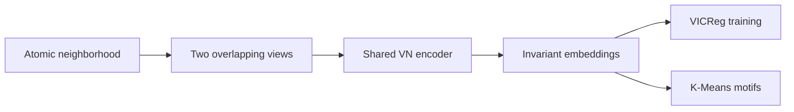

# Self-supervised motif discovery in molecular dynamics

Reference implementation and runnable demonstration for **“Self-Supervised Rotation-Invariant Representations for Unsupervised Motif Discovery in Molecular Dynamics”** by Vsevolod Morozov, Emilie Devijver, Charlotte Laclau, Paul Krzakala, and Noel Jakse.

The method learns clusterable representations of local atomic neighborhoods directly from coordinates. A rotation-equivariant Vector Neuron encoder is trained with VICReg on overlapping views; K-Means then discovers structural motifs without using labels during representation learning.

[Read the paper](paper/paper.pdf) · [Open the executed demo](notebooks/synthetic_motif_demo.ipynb)

## Method



The encoder keeps directional information in equivariant vector features and derives rotation-invariant scalar embeddings for the self-supervised objective and clustering. Labels are used only after training to report evaluation metrics.

## Quick start

```bash
git clone https://github.com/maloq/PointCloudMaterials.git
cd PointCloudMaterials
git switch paper_demo

conda create -n pointnet python=3.12 -y
conda activate pointnet
pip install -r requirements.txt

jupyter lab notebooks/synthetic_motif_demo.ipynb
```

Run the notebook from top to bottom. It generates randomized BCC, FCC, and amorphous neighborhoods in memory, trains the encoder without motif labels, clusters held-out embeddings, and repeats inference after independent random SO(3) rotations. Interactive 3D views let you rotate and inspect both the atomic neighborhoods and the learned embedding space.

The executed reference run stored in the notebook reaches approximately `0.97` clustering accuracy and `0.90` adjusted Rand index. Its mean rotation-relative embedding error is below `1e-6`. The code selects CUDA when available and otherwise runs unchanged on CPU.

## What the demo represents

The notebook is a compact check of the full method, not a reproduction of the paper's numerical tables.

| | Notebook | Paper benchmark |
|---|---:|---:|
| Motifs | BCC, FCC, amorphous | BCC, FCC, HCP, amorphous |
| Raw neighborhood | 80 atoms | 128 atoms |
| Encoder view | 56 atoms | 80 atoms |
| Default encoder | compact `VN_REVNET_Atomic` | full VN-RevNet |
| Evaluation | one fixed train/test seed | five independent runs |

HCP is intentionally omitted from the small example because reliable FCC/HCP separation depends on stacking information across larger neighbor shells.

## Encoder alternatives

Set `ENCODER_VARIANT` near the top of the notebook to test the retained paper architectures and controls:

| Value | Encoder | Purpose |
|---|---|---|
| `vn_atomic` | Atomic VN-RevNet | recommended invariant demonstration |
| `vn_dgcnn` | VN-DGCNN | equivariant backbone alternative |
| `vn_pointnet` | VN-PointNet | simpler equivariant alternative |
| `dgcnn` | DGCNN | rotation-sensitive control |
| `pointnet` | PointNet | rotation-sensitive control |

The regular DGCNN and PointNet controls intentionally do not guarantee rotation-invariant embeddings, so their rotation check is expected to differ from the VN models. The registry also retains the RI-MAE invariant encoder and additional sizes/backbones used during model exploration. Hand-crafted Steinhardt, common-neighbor-analysis, and SOAP baselines are available in `src/baselines/descriptor_baselines.py`.

## Repository layout

```text
.
├── notebooks/synthetic_motif_demo.ipynb  # executed end-to-end example
├── paper/                                # manuscript source and PDF
├── src/
│   ├── baselines/                        # structural descriptor baselines
│   ├── models/encoders/                  # paper encoders and runtime adapter
│   ├── training_methods/contrastive_learning/
│   │   └── vicreg.py                     # self-supervised objective
│   └── utils/                            # point-cloud and evaluation helpers
├── tests/                                # symmetry, encoder, and VICReg checks
└── requirements.txt
```

This demonstration branch is deliberately narrow. Post-submission simulation campaigns, temporal model stacks, infrastructure-specific launch scripts, and their configuration trees are excluded.

## Branches and provenance

- `paper_demo` is the cleaned, notebook-first public demonstration.
- `paper_version` preserves the implementation and configurations used at submission time.
- `main` contains later research development from which the maintained encoder code was selected.

Use `paper_version` to audit the exact submission-era implementation. Use `paper_demo` for the shortest runnable path through the current method.

## Reproducibility

- NumPy, PyTorch, dataset, DataLoader, and K-Means seeds are fixed in the notebook.
- Motif labels never enter optimization.
- Clustering accuracy uses Hungarian matching because K-Means cluster identifiers are arbitrary.
- Rotation robustness is measured after independently rotating every held-out cloud.
- The notebook records its environment, training history, metrics, and plots directly in the committed output cells.

## Citation

If you use this repository, please cite:

```bibtex
@misc{morozov2026motif,
  title  = {Self-Supervised Rotation-Invariant Representations for
            Unsupervised Motif Discovery in Molecular Dynamics},
  author = {Morozov, Vsevolod and Devijver, Emilie and Laclau, Charlotte and
            Krzakala, Paul and Jakse, Noel},
  year   = {2026}
}
```
