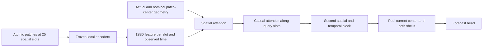

# Spatial context: implementation audit and next experiments

Reviewed 25 September 2026. This is a proposal and source audit; no new context
experiment was launched. [Handbook](README.md) · [Input policy](prediction_context.md)

The symmetric predictor already represented the geometry between patch centers.
Its main limitation was that it received compressed local features: MACE's
invariant export cannot carry the orientation of each patch relative to another
patch. Preserving orientation until patches interact is a useful next experiment,
alongside a controlled test of how much the broader observations help at all.

## What the symmetric implementation actually did

Two related campaigns used this architecture:

| Detail | Original symmetric study, 21 September | Latest relaxed reuse, 22 September |
| --- | --- | --- |
| Inputs | Frozen MACE or historical GATr local features | Frozen original MACE or development-selected relaxed MACE |
| Query layout per observation | Center +12 queries at10 Å +12 at20 Å | Same25-query layout |
| History | −48, −12, −3,0 ps:100 tokens | Latest3 available real observations within72 ps:75 tokens; irregular actual offsets |
| Query atom selection | Unique assignment in each observed frame | Select identities in observed geometry and retain them through relaxation |
| Trainable part | Forecasting heads; local encoders frozen | Forecasting heads; local encoders frozen |
| Local latent forecast target | Each backbone's own exported space | Shared original MACE space for both arms |

The12 directions are all permutations of `(±1, ±1, 0)/sqrt(2)`: the vertices of
a cuboctahedron. Only the queries are exactly symmetric. A minimum-cost Hungarian
assignment selects24 distinct real atoms nearest the queries, with an allowed
offset of at most4 Å. The focal atom supplies slot0. Periodic minimum-image
coordinates are used. Temporal attention follows each *query slot*; an outer
slot may switch atom identity between observations.

Each selected atom anchors an ordinary local encoder neighborhood, producing a
128-dimensional feature. MACE's recorded local support was7.94 Å and GATr's
16.87 Å. Thus20 Å is a query radius, not the full atomic observation radius.
With a4 Å query offset, outer MACE patches can reach approximately31.94 Å from
the focal atom. Patches overlap. The original MACE/GATr comparison did not hold
atomic support fixed.

Two width128, four-head blocks alternate spatial attention within an observation
with causal temporal attention along a slot. Final pooling uses the last
observation. Center, inner shell and outer shell have equal total mass: weights
`1, 1/12 ×24`, divided by3. Those weights also enter spatial attention as a log
prior. The output combines this pooled context with the current central token
captured before the attention blocks and with historical condition inputs.

This was spatial interaction between already pooled local embeddings. The broader
context did not change what the frozen atom-level encoder computed inside a patch.

Producers: [query geometry](../../src/research/structured_context/geometry.py),
[context model](../../src/research/structured_context/model.py),
[original data](../../src/research/structured_context/data.py),
[relaxed reuse data](../../src/research/structured_context/reuse_data.py).
Protocols: [original](../../experiments/structured_context_20260921/README.md),
[relaxed reuse](../../experiments/structured_relaxed_reuse_20260922/README.md).

## Exactly how geometric relationships entered the model

Let q_i be the nominal query, r_i the actual patch center relative to the focal
atom, and e_i=(r_i−q_i)/(4 Å). Four scalar node features were projected and added
to the embedding:

- |q_i|/(20 Å): nominal shell radius;
- |r_i|/(25 Å): actual radius;
- |e_i|²: query-assignment error magnitude;
- e_i·q_i/(20 Å): radial component of that error.

For every attended pair, a `5 →32 →number_of_heads` MLP produced an attention
bias from the following five numbers:

\[
g_{ij}=\left[
\frac{\|r_i-r_j\|^2}{(25\,\mathrm{Å})^2},
\frac{\|q_i-q_j\|^2}{(20\,\mathrm{Å})^2},
e_i\cdot e_j,
\frac{t_i-t_j}{48\,\mathrm{ps}},
\left(\frac{t_i-t_j}{48\,\mathrm{ps}}\right)^2
\right].
\]

Attention logits were Q_i·K_j/sqrt(d_head) + MLP(g_ij) + log(w_j).
Temporal attention masked future observations. Actual observation offsets and
their squares were also projected into node features.

The model therefore knew center-to-center distances, nominal spatial arrangement
and assignment distortions. It could distinguish adjacent and opposing patches.
Radii and pair distances also contain angular information through the cosine
rule; absence of explicit angles does not imply absence of all angular information.

However, messages carried ordinary learned scalar channels. There were no
geometric vector/tensor values conveying each local patch's orientation. A scalar
invariant can indicate that a patch is ordered without identifying its crystal
axes. Relative patch-center positions cannot generally reconstruct those axes.
Overlapping patches may supply indirect evidence, but do not guarantee recovery.

The head's scalar geometry is invariant under a joint rotation of actual and
nominal coordinates. The *sampler* fixes the stencil to the simulation box; after
rotating a cloud and reassigning atoms to that fixed stencil, predictions need
not agree. It has cubic symmetry, not general continuous rotation invariance.
Hard assignment can also replace a patch abruptly under a small coordinate change.
No smooth boundary envelope was applied to the discrete context slots.

## Other historical inputs and the later hierarchy

The symmetric predictor was not an embeddings-only assay. It also received five
temperature indicators, simulation age/600 ps and its square, plus an auxiliary
descriptor branch. The latter used93 current physical/order descriptors, their
historical differences and4 outer-shell summaries. Its504-input allocation
reserved128 unused extra-encoder channels. The original run used three descriptor
differences; relaxed reuse used two and zero-filled the unused third. These
fields are verified in the tensor producers above and
[context.py](../../src/research/context_night/context.py).

All future comparisons must remove those temperature and time covariates under
the current user policy. A current-frame-only spatial experiment avoids mixing
history changes with spatial changes. Descriptors, if used, need explicitly named
controls and a separate input contract; they must not be hidden beside z.

The later [spatial hierarchy implementation](../../src/research/spatial_hierarchy/model.py)
was different: three nested balls around one focal atom, with maximum support
8,12 or16 Å. Each region had49 invariant features:6 radial density coefficients,
21 cross-radial Gram entries for each of l=2 and l=4 harmonic moments, and a
smooth count. Early-fusion arms fed these region tokens into local MACE blocks;
the late arm fused at the output. This already provided a route for context to
change the encoder. But contracting the moments into separate Gram matrices
removed their orientation before different scales interacted. Historical onset
heads also used temperature; see the input ledger rather than treating those
results as condition-free baselines.

## Relevant literature and what transfers to this problem

These are architectural precedents, not evidence of better Al onset AP.

| Primary source | Mechanism worth testing here | Qualification |
| --- | --- | --- |
| [Point Transformer, ICCV2021](https://arxiv.org/html/2012.09164v2) | Learned relative positions enter both attention weights and transmitted features. | Its channelwise “vector attention” is not a geometric 3D vector; an arbitrary XYZ MLP does not impose rotation equivariance. |
| [PaiNN, ICML2021](https://proceedings.mlr.press/v139/schutt21a.html) | Coupled scalar/vector states communicate using radial filters and inter-node directions. | A compact starting point for region-to-region messages; scalar/vector molecular results do not settle crystal orientation requirements. |
| [Equiformer, ICLR2023](https://arxiv.org/abs/2206.11990) | Equivariant attention and tensor products carry irreducible geometric features between nodes. | Applicable to local-region nodes as an architectural proposal, although the paper benchmarks atomistic graphs. |
| [EquiformerV3, April2026 preprint](https://arxiv.org/html/2604.09130v1) | Smooth radius envelopes enter attention normalization as well as message values. | Fixes an attention-cutoff mechanism; it cannot fix a separate hard query-assignment jump. |
| [PRISM, npj Computational Materials2026](https://www.nature.com/articles/s41524-026-02074-1) | Bidirectional atom/superatom exchange lets broad context modify local features. | Its cross-scale expert is explicitly geometry-agnostic; hierarchy alone does not supply relative orientations. |
| [Ewald message passing, ICML2023](https://proceedings.mlr.press/v202/kosmala23a.html) | A Fourier-space branch communicates nonlocal information with a frequency cutoff. | A later whole-cell option if local-radius gains keep growing; not the first choice for a finite local onset target. |
| [Lechner–Dellago, JCP2008](https://arxiv.org/abs/0806.3345) | Neighbor-averaged spherical-harmonic bond-order coefficients add structural context before invariant reduction. | Motivates an inexpensive orientation-preserving descriptor control, separate from a fully learned encoder. |

## Proposed experiments, in order

Start from the existing supervised AP3/AP6 population and source roles. Consult
the registered raw/relaxed parent cells to recover broader *current* geometry;
the compact80-atom training cache alone cannot supply a20 Å context. New feature
extraction is needed; new simulation is not implied. Freeze observation
availability before fitting and use a common intersection for matched arms.

First ask whether the context helps the predictor, using one fixed local
checkpoint, one seed and capacity-matched heads:

| Arm | Observation and interaction | Question |
| --- | --- | --- |
| C0 | Central embedding only | Current local baseline |
| C1 | Center plus smooth shell means/variances/counts of neighboring embeddings | Is broader composition useful without detailed layout? |
| C2 | Same region embeddings, with distance/radius features in both attention and messages | Does the arrangement of surrounding states add information? |
| C3 | C2 plus current q_lm orientation fields and their pair/direction contractions | Does relative local order orientation add information beyond scalar z? |

Use the old25-slot scheme only for a clearly labelled historical-layout control.
For a smooth, rotation-consistent main comparison, retain atom-centered context
nodes under a radius envelope, pool their features with continuous weights and
compare all arms on the same observed atom set. Hard top-k/downsampling must not
quietly become a new discontinuity. Keep a broad candidate halo and record the
full atom-level reach of every local encoder, beyond the context-node radius.

C3 can be cheap: retain current q_4m and q_6m coefficients rather than only their
norms. Their contractions across patches reveal alignment; contractions with
Y_l of the separation direction relate order to spatial placement. These are
explicit observed structural descriptors, not crystal labels or future inputs.
The test is an orientation-information control, not proof that an end-to-end
neural architecture has learned it. Higher angular order matters here: low-order
vectors/quadrupoles can vanish at an ideal cubic site while cubic orientation
remains meaningful. Do not assume l≤2 alone resolves crystal alignment.

If context survives these controls, train one hierarchical encoder jointly:

1. Retain scalar and equivariant features from local MACE before invariant export.
2. Exchange two or three layers of coarse spatial messages using periodic
   relative displacements, radial bases and spherical harmonics. A schematic
   term is a_ij [W h_j ⊗ Y_l(r_hat_ij)]_L: a_ij is invariant, and the tensor
   product produces a correctly transforming output of order L.
3. Feed the coarse context back into focal atom features before the last local
   block. Pool/export one128-D invariant state only after that interaction.
4. Train onset likelihood plus the existing source-weighted AP3/AP6 objective;
   retain the same readout/calibration protocol and log every input separately.

An efficient alternative extends our nested-ball prototype: preserve harmonic
moments and cross-scale orientation contractions instead of reducing each ball
independently to49 invariant numbers. Nested smooth balls avoid a box-axis query
frame. Retaining only a few angular orders is still a lossy summary; compare it
with the region graph rather than assuming equivalence.

Use smooth envelopes inside normalization:

\[
a_{ij}=\frac{w(d_{ij})\exp s_{ij}}
{\sum_k w(d_{ik})\exp s_{ik}+\epsilon}.
\]

Preserve smooth weighted counts separately. Tapering only the value while an
unweighted neighbor still enters the denominator does not remove cutoff jumps.
All feature frames must rotate together; independently canonicalizing every
patch can erase the very relative orientation the context model needs.

For speed, frozen features can be cached and the coarse graph trained cheaply.
Fine-tuned features must be recomputed. Shared atom-level work across overlapping
regions can reduce duplication, but a single expanded MACE graph changes the
receptive field compared with separately truncated patches; record and control
that change. Increase radii separately from encoder width. Choose the backbone
from selection results of the current capacity study, not its test AP.

## What would establish useful spatial context

Primary AP3, secondary AP6; natural at-risk populations, fixed source roles,
calibration-only probability fitting, paired source-bootstrap differences. This
is exploratory reuse of an already inspected test set, not a fresh confirmation.
One seed does not estimate training-seed uncertainty.

Compare layout-aware models with shell-preserving permutations of embeddings
among positions, and train a matched geometry-free control. Apply rigid rotations
to the entire physical input, including the periodic cell, and re-extract inputs
to test the whole pipeline. Separately perturb coordinates across neighborhood
boundaries. Report realized noise RMS relative to local neighbor spacing, AP
under noise, normalized embedding movement at0.75 ps where actual pairs exist,
movement spectrum and whole-dataset spectrum. Never substitute12 ps pairs for
the requested0.75 ps metric. Include extraction cost, samples/second and VRAM.

Neither a better historical conditioned head nor a larger support alone proves
that geometric message passing improved the representation. The C0–C3 progression
and early-versus-late fusion comparison isolate those questions.
