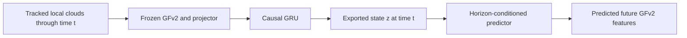

# Smooth and predictive GeoFrame states — September 5, 2026

Research design record; no new model has been trained for this proposal.

**Superseded architecture recommendation:** the subsequent
[literature review and GeoFrame v3 proposal](geoframe_v3_literature_20260905.md)
recommends continuous equivariant geometry followed by motion-transported memory.
It incorporates the completed switch audit and relevant prior art. The design
below is retained as the earlier research record; frozen-GFv2 filtering remains
a baseline rather than the principal architecture candidate.

Follow-up: the [completed continuity audit](../output/geoframe_continuity_20260905/RESULTS.md)
now confirms finite embedding jumps from triad frame switches in both checkpoints,
including float32 Ta. With patch identities fixed, motion-based frame transport
removes essentially all of the isolated switch-boundary jump. The architecture
discussion below records the original proposal; the linked experiment provides
the new measurements and their limits.

The recommended first experiment is a small causal temporal model over frozen
VICReg epoch-49 features, trained to predict future features at several horizons.
Use an explicit smoothness term on its exported state and preserve independently
measurable structural information. Compare it with simple causal averaging before
fine-tuning GeoFrame. A stronger adjacent-frame attraction alone does not define
the dynamics that a forecast model needs to learn.

The intended output is a slowly evolving structural state. Its smoothness must
be specified at a physical timescale: suppressing sub-picosecond fluctuations
should still allow a real rearrangement to change the state. A representation
that requires recent observations is a history-dependent state; it changes the
inference contract relative to the existing single-snapshot encoder.

**Evidence from this repository.** The [completed Al/Mg/Ta comparison](../output/geoframe_v2_spatiotemporal_analysis_20260905/RESULTS.md)
supports starting with the VICReg projector. Its absolute temporal MSE improves
on all three materials. The raw encoder's absolute temporal MSE increases,
although its relative MSE improves, and its effective rank falls. On Al, for
example, encoder relative MSE goes from 0.432 to 0.105 while absolute MSE goes
from 0.0374 to 0.0394 and effective rank from 3.13 to 1.92. Smoothness evaluation
must therefore include scale, dimensionality, and retained information.

The improvement is heterogeneous. The Al 166 ps branch improves only about 5%
in relative drift. That branch deserves a separate evaluation of stable regions
and rearrangements; its large drift has not been identified as either pure
thermal noise or useful structural evolution.

The [earlier 30 fs audit](../output/geoframe_temporal_stability_comparison_finest_30fs_20260904/README.md)
found large drift despite deterministic inference and accurate rotation
invariance. Local neighborhoods retained 98.1% of their 160 atoms at 30 fs.
This motivates a thermal sensitivity and internal geometry audit. That audit
used the original model with 160-point inputs; it is a separate protocol from
the new 80-point fine-tune comparison.

The [predictive-atlas progress report](predictive_atlas_current_progress_20260903.md)
already contains useful negative results: ordinary-MD encoder training improved
realized-future prediction by 0.95% while slightly degrading shooting-law
retrieval; direct final-block fine-tuning repeatedly selected the unchanged
encoder. A small history model helped modestly, while simply flattening more
history/context did not. These results support a controlled frozen-feature
experiment and keeping epoch -1 eligible when subsequently fine-tuning.

**First experiment: learn a causal state and forecast a fixed target.** Let
`y_t = projector(GeoFrame(X_t))` be the frozen epoch-49 representation of an
80-atom neighborhood centered on the same tracked atom ID at every time.
Standardize teacher features using optimization data only and freeze that
transformation. Use continuous sequences from the trajectories, with their
actual periodic boxes and physical timestamps. The existing independent triplet
cache does not contain the contiguous histories required by this objective.

At the available 0.1 ps cadence, begin with five observations spanning 0.4 ps;
compare nine observations spanning 0.8 ps. These are proposed settings to
select on validation, rather than measured optimal timescales. Encode the
sequence with a small GRU (for example, hidden width 64) and a 16- or
32-dimensional exported state:

\[
z_t = H_\theta(y_{t-k\delta},\ldots,y_t;c), \qquad
\widehat y_{t+\Delta}=D_\psi(z_t,c,\Delta).
\]

Here `c` includes material and known simulation conditions such as temperature
and thermostat/protocol. Do not condition on unobserved future measurements.
Start with horizons 0.1, 0.5, 1, and 2 ps. The shared model should be evaluated
separately for each material; normalization of geometry does not make their
physical relaxation times equal.

The primary loss predicts the fixed future teacher features at multiple
horizons. Report its prediction of *change* as well as absolute future error,
and always compare with the zero-change/persistence prediction. A lagged
prediction objective has precedent in
[time-lagged autoencoders for molecular kinetics](https://arxiv.org/abs/1710.11239);
the particular short-history design here is a proposed experiment.

Add a weak discrete curvature penalty on the **exported** `z`, evaluated on
adjacent windows at the same sampling interval:

\[
L_{\mathrm{curve}}=
\mathbb E\|z_{t+\delta}-2z_t+z_{t-\delta}\|^2.
\]

This penalizes abrupt changes of direction while permitting steady evolution.
It does not guarantee useful smoothness and can still suppress a transition
if weighted too strongly. Compare zero and small nonzero weights. Do not use
the same numerical curvature weight across different sampling intervals without
accounting for the interval dependence.

Retain variance/covariance regularization on `z` and evaluate effective rank
within each material and source, so separation of materials alone cannot
satisfy the information-preservation test. Keep a modest spatial/augmentation
consistency term and structural readouts as additional constraints. Neighboring
centers can lie on opposite sides of an interface; their equality should not
override evidence of a structural difference. Do not require all 128 original
dimensions to have equal variance: the useful state dimension is an empirical
question. All methods must retain comparable ability to distinguish physical
states on held-out data.

The fixed teacher prevents future targets from becoming easier merely because
the encoder shrinks or erases information. A trainable predictor and an EMA
target alone are insufficient evidence against collapse. Dense sequences can
be encoded once while GeoFrame is frozen, making this first experiment much
cheaper than another end-to-end sequence run.

**Predicting the new state itself.** The first experiment predicts future
GeoFrame features from a learned state. A reusable latent simulator requires a
transition model for that state as well:

\[
\widehat z_{t+\delta}=F_\omega(z_t,c), \qquad
\widehat z_{t+n\delta}=F_\omega^{(n)}(z_t,c).
\]

Start with a linear autoregressive transition as a baseline, then a small
residual MLP if justified. Fit against encoded future states while retaining
the fixed-teacher future prediction loss. During a joint training stage,
stop-gradient or EMA targets can stabilize state matching, with the fixed
teacher and structural constraints still anchoring the objective.

Train and evaluate several rollout lengths. After initialization, a rollout
must use only its own predicted states and known conditions; feeding it future
observations would test filtering instead. Horizon-specific direct forecasts
and repeated one-step rollouts should be reported separately. Existing
predictive-atlas GIFs apply an encoder to observed future configurations and
do not establish this autonomous forecasting capability.

A very smooth structural state may omit momentum or other fast memory needed
for accurate short-term prediction. If prediction still depends on history
after conditioning on `z_t`, add a separate kinetic memory to the transition
state, or supply properly invariant/equivariant velocity information where
available. Keep the smooth exported structural coordinates distinct from that
additional memory. Position-only invariant embeddings cannot be assumed to
form a closed Markov state for local MD.

For stochastic or partially observed dynamics, squared-error training estimates
a conditional mean. That mean can be smooth even when individual realizations
diverge, and can fall between physical outcomes. Longer-horizon forecasting
should therefore predict conditional distributions when repeated shooting
data support them. The existing RFF future-law implementation is directly
relevant. In the earlier Al audit, conditional-mean future R2 was about
0.65–0.71 at 6–24 ps, compared with about 0.38–0.43 for an individual future;
these are results for that older benchmark, not forecasts of this proposal's
performance on Al/Mg/Ta.

**A separate architecture check is warranted.**
[GeoFrame's grouping implementation](../src/models/encoders/ri_mae_encoder.py)
uses farthest-point sampling, hard nearest-neighbor membership, and a nearest
path ordering. Its triad frame uses `argmax` selections for the primary and
secondary axes and discrete sign conventions. Small coordinate changes can
switch these choices. This establishes potential sources of discontinuity;
their contribution to the measured embedding drift has not been quantified.

Measure embedding changes along small, atom-matched coordinate perturbations
and interpolations while logging group membership and axis selection changes.
Use periodic local offsets, and separate outer-neighborhood switches from
internal patch/frame switches. Existing repeat and rotation tests do not test
continuity under physical perturbations.

If switching explains a substantial fraction of the large jumps, compare an
architecture with smooth radial cutoffs and aggregation, and either continuous
weighted frame averaging or invariant/equivariant features without a selected
canonical frame. Preserve any required chirality information in that comparison.
Changing only the triad to PCA does not guarantee continuity near eigenvalue
degeneracies. The general issue and continuous weighted-frame constructions
are treated by
[Dym, Lawrence and Siegel](https://arxiv.org/abs/2402.16077); that result does
not prove the cause of our current failures. This architectural path matters
especially if the eventual encoder must work on a single snapshot without
temporal memory.

**Data that can be used now, and data that would improve the answer.**

| Data | Immediate use | Limitation |
|---|---|---|
| Existing Al/Mg/Ta 24 ps continuations, 0.1 ps cadence | Frozen-feature histories and 0.1–2 ps forecasts | Al/Mg coordinate quantization; no independent Ta source |
| Original Al nested pilot's dense 30 fs prefixes | Fast-motion diagnostics and very short history ablations | Only the actual dense prefix supports this cadence; it cannot supply a full dense long-horizon benchmark |
| Existing Al shooting ensembles | Conditional-mean/law evaluation, velocity ablations where stored | Different protocol from the Al/Mg/Ta continuations; keep evaluation and conditioning explicit |

The latest [simulation audit](simulation_audit_20260905.md) reports 640 existing
Al futures over 40 old parents, with 16 futures per parent at horizons through
12 ps. The newly completed 15 ps top-up has float32 positions and velocities
at 0.3 ps cadence. This is useful existing data for distributional evaluation;
it does not resolve 30 fs jitter. The larger new-parent production campaign
was still ungenerated at that audit. Reuse the verified shooting index and its
source-lineage splits rather than treating different archives of the same
trajectory as independent futures.

The Al/Mg continuation inputs used for the recent training store global
coordinates in float16, with a reported maximum position error of 0.125 Å.
The Al 166 ps conversion report also measured local distance errors up to
0.224 Å. This precision is unsuitable for a clean claim about arbitrarily
small motions. Retrieve original higher-precision trajectories if retained;
otherwise regenerate a targeted subset. Casting the current arrays to float32
does not recover precision.

The most useful additional simulations are independent sources for each
material, especially Ta, with float32 positions, atom IDs, boxes, velocities,
physical times, and thermostat metadata. Dense 10–30 fs output over short
bursts would resolve fast fluctuations; coarser 0.1 ps output over longer
paths supports slow evolution. More independently initialized smaller systems
are likely to be statistically more useful than more centers from one
million-atom trajectory, provided the boxes remain large enough for the
relevant structural length scales. This is a proposed sampling design, not a
request to change existing simulation protocols automatically.

**Comparison and acceptance.** Run these steps in order:

| Candidate | Question it answers |
|---|---|
| Original static GFv2, using the same fixed forecast targets | Does the recent temporal fine-tune actually retain more predictive information? |
| Current VICReg projector | Unfiltered reference |
| Causal exponential/moving average, selected timescale | How much smoothing is available without learning? |
| Linear autoregression on current and recent features | How much future signal is accessible to a simple model? |
| Frozen GFv2 + causal predictive state, with/without curvature | Does learned filtering preserve more predictive structure at comparable smoothing? |
| Last-block fine-tune with fixed-teacher and static constraints | Does changing GFv2 improve the accepted temporal model? Include unchanged weights in selection. |
| Smooth-geometry architecture, if the switch audit warrants it | Is discrete geometry a limiting factor? |

Use identical source splits and forecast targets, including when comparing
original and fine-tuned input encoders. Retain the existing frozen-teacher
shooting-law benchmark as a separate downstream test. Balance materials and source
trajectories rather than counting correlated windows as independent samples.
Keep all descendants of a source in one partition, including neighborhood
context. Whole input-history and future-target windows must fit inside their
partition; adjust guards when extending the existing 0.5 ps forecast horizon
to 2 ps. A Ta test with the current single trajectory remains a within-source
test even if its central atom IDs are disjoint.

Report drift distributions, particularly the 95th percentile, at each lag;
train-calibrated feature scale, effective rank, within-source state separation;
structural readouts and transition timing; and forecast skill against persistence:

\[
\mathrm{skill}(\Delta)=1-
\frac{\mathrm{MSE}(\widehat y_{t+\Delta},y_{t+\Delta})}
{\mathrm{MSE}(y_t,y_{t+\Delta})}.
\]

Report undefined skill explicitly when the persistence denominator is zero.
Positive skill is necessary but compare against the trained linear/history
baselines too. Evaluate fixed teacher targets and physical observables so a
change of latent scale cannot manufacture a gain. Plot smoothing against
transition delay and forecast error across filter strengths, rather than
selecting the smoothest curve alone. Causal averaging is expected to introduce
delay; centered averages use future observations and cannot serve as an online
forecast input.

Separate stable liquid, stable crystal, interfaces and actual rearrangements
using independently computed physical diagnostics. Continue full static Al
evaluation when GeoFrame itself changes, and add comparable Mg/Ta structural
checks; cluster silhouette alone does not measure structural accuracy. Estimate
uncertainty across independent source trajectories, with multiple training seeds
for finalists. A successful model reduces jitter while preserving transitions
and improves held-out future prediction; a smooth trajectory alone is insufficient.

The reusable implementation should extend the existing temporal packages:
[shooting history](../src/temporal_vamp/shooting_history.py),
[predictive atlas](../src/temporal_vamp/predictive_atlas.py), and
[temporal encoder training](../src/temporal_vamp/temporal_encoder_pretraining.py).
The new contiguous-window producer is scientifically different from the current
[spatiotemporal triplet producer](../src/data_utils/spatiotemporal_views.py).
Future experiment configurations and reproduction instructions belong in an
`experiments/` record, with generated analysis under repository `output/`.
