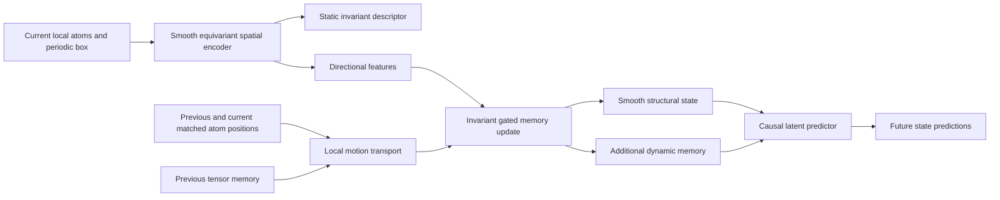

# GeoFrame v3: literature review and architecture proposal

September 5, 2026. **Research design record; the subsequent pilot is linked below.**
Primary papers and repository code were reviewed for this proposal. Publication
status is distinguished from preprint status below. This is a focused literature
review, not an exhaustive priority search or a claim of established novelty.

**Experimental update:** the [completed pilot](../output/smooth_temporal_encoder_20260905/RESULTS.md)
trained six spatial and twelve temporal models on Al/Mg/Ta and evaluated all
772,953 saved static-Al centers. Smooth neighborhoods remove the selected frame
switches. Ordinary recurrent memory currently gives the best smoothness/structure
tradeoff; transported memory adds no measurable prediction benefit over matched
memory without transport. The models trained only on MD continuations transfer
less well to static Al than GFv2. The next recommendation is therefore smooth
geometry with ordinary memory, mixed static/MD training, and transported variants
retained as ablations. The proposal below records the hypotheses tested, not
claims established by the pilot.

**Recommendation:** replace hard canonicalization and hard neighborhood selection
with a smooth equivariant spatial encoder. Build a causal temporal state on its
directional features, transporting remembered features with local motion before
updating them. Keep a static descriptor, a smooth structural state, and the
additional memory needed for prediction as explicit outputs.

The first experiment should establish how much a continuous spatial encoder
already fixes. The possible research contribution is the subsequent temporal
transport mechanism and its treatment of ambiguous motion and real structural
changes. MACE plus a GRU, temporal canonicalization, and geometric transport each
have substantial prior art.

## 1. What the repository establishes

The [continuity audit](../output/geoframe_continuity_20260905/RESULTS.md) isolates
frame switches with all atom and patch identities fixed. In one float32 Ta case,
a coordinate separation of approximately 2.09e-6 Å RMS produces a 148.78-degree
frame switch and an encoder difference of 1.1193. Holding or transporting the
frame reduces that difference to approximately 1.15e-5.

All 72 sampled interpolation paths contain frame switches. With fixed patch
identities, transported frames reduce the temporal VICReg encoder's p95 step
distance by approximately 86%, 86%, and 89% on Al, Mg, and Ta. Fixing neighborhood
and patch selection separately also reduces jumps.

These are controlled coordinate interpolations between saved MD endpoints,
including deliberately selected switch boundaries. They demonstrate a failure
mechanism, not the proportion of ordinary MD drift caused by it. They also do
not establish that the intervened pretrained network retains structural quality.

The [training comparison](../output/geoframe_v2_spatiotemporal_analysis_20260905/RESULTS.md)
shows why smoothness alone is insufficient: relative encoder drift improved
while absolute drift increased and effective rank fell. The new architecture
must preserve information at a controlled output scale, not simply make vectors
smaller or delay every change.

## 2. Literature that changes the design

Each linked title points to a primary paper, proceedings page, or author preprint.
The final column is our interpretation for this project, rather than a result
claimed by the paper about GeoFrame.

| Work and status | Relevant contribution | Consequence for this project |
|---|---|---|
| Dym, Lawrence & Siegel, [Equivariant Frames and the Impossibility of Continuous Canonicalization](https://proceedings.mlr.press/v235/dym24a.html), ICML 2024 | Establishes continuity obstructions for canonicalization/frame constructions and develops continuity-preserving weighted frames. | A unique static orientation is a problematic architectural requirement. This does **not** prohibit continuous invariant embeddings. |
| Pozdnyakov & Ceriotti, [Smooth, exact rotational symmetrization for deep learning on point clouds](https://arxiv.org/html/2305.19302v2), NeurIPS 2023 | ECSE averages predictions over neighbor-pair frames, with weights vanishing near cutoffs and degenerate pairs. Its base network must already be smooth. | Closest direct alternative if retaining a frame-based architecture. Equal averaging or averaging a few hard-selected frames is insufficient. |
| Zhang et al., [End-to-end Symmetry Preserving Inter-atomic Potential Energy Model for Finite and Extended Systems](https://arxiv.org/abs/1805.09003), NeurIPS 2018, DeepPot-SE | Smooth invariant atomic descriptors replace discontinuous constructions in earlier Deep Potential models. | Local-frame discontinuities and their removal already have a close atomistic precedent. |
| Bartók, Kondor & Csányi, [On representing chemical environments](https://arxiv.org/abs/1209.3140), Physical Review B 2013, SOAP | Represents atomic environments through smooth densities and rotational invariants. | SOAP plus PCA or a small learned head is an essential inexpensive baseline. |
| Schütt, Unke & Gastegger, [Equivariant message passing for the prediction of tensorial properties and molecular spectra](https://proceedings.mlr.press/v139/schutt21a.html), ICML 2021, PaiNN | Uses interacting scalar and vector features for atomistic prediction. | A relatively small equivariant baseline; scalar/vector features alone are not the entire proposed crystal-orientation memory. |
| Batatia et al., [MACE: Higher Order Equivariant Message Passing Neural Networks for Fast and Accurate Force Fields](https://arxiv.org/abs/2206.07697), NeurIPS 2022 | Combines equivariant features with higher body-order messages. | Reuse its representation blocks; the representation need not be trained as an energy or force model. |
| Musaelian et al., [Learning local equivariant representations for large-scale atomistic dynamics](https://www.nature.com/articles/s41467-023-36329-y), Nature Communications 2023, Allegro | Builds expressive strictly local equivariant representations without conventional atom-centered message passing. | An alternative when strict locality and scaling matter; not evidence of temporal smoothness in our current data pipeline. |
| de Haan et al., [Gauge Equivariant Mesh CNNs: Anisotropic convolutions on geometric graphs](https://arxiv.org/abs/2003.05425), ICLR 2021 | Transports directional features between local coordinate systems on meshes. | Transporting learned features is established. Our question concerns temporal motion and changing atomic neighborhoods. |
| Rempe et al., [CaSPR: Learning Canonical Spatiotemporal Point Cloud Representations](https://arxiv.org/abs/2008.02792), NeurIPS 2020 | Learns canonical spacetime representations and continuous latent dynamics for point-cloud sequences. | “Canonicalization using time” alone is not a defensible novelty claim. Its object-centric setting differs from periodic local materials. |
| Wu et al., [Equivariant Spatio-Temporal Attentive Graph Networks to Simulate Physical Dynamics](https://neurips.cc/virtual/2023/poster/72921), NeurIPS 2023, ESTAG | Combines equivariant spatial processing with historical periodic features and temporal attention. | Equivariant history models already address unobserved dynamics. Include a conventional history baseline before attributing gains to transport. |
| [Force-free molecular dynamics through autoregressive equivariant networks](https://www.nature.com/articles/s42256-026-01227-7), Nature Machine Intelligence 2026, TrajCast | Predicts phase-space updates using equivariant atomic networks with positions and velocities. | Strong recent precedent for learned atomistic propagation. Its velocity inputs, training ensemble, and step size differ from our sparse position-only histories. |
| Freitas et al., [Learning turbulent transport via Mori–Zwanzig graph neural networks](https://arxiv.org/abs/2606.14918), June 2026 preprint | Uses an equivariant finite-memory expansion over current and delayed particle graphs for reduced dynamics. | Memory for partially observed particle systems is established; this paper studies turbulent tracers rather than structural states of metals. |
| Iyengar et al., [Align Your Structures: Generating Trajectories with Structure Pretraining for Molecular Dynamics](https://arxiv.org/abs/2604.03911), ICLR 2026 as recorded by the authors | Separates structure pretraining from learning temporal dependence in molecular trajectory generation. | Supports evaluating static representation quality before adapting to scarce temporal data. It is a generative method, not our proposed encoder. |
| Wehmeyer & Noé, [Time-lagged autoencoders: Deep learning of slow collective variables for molecular kinetics](https://arxiv.org/abs/1710.11239), Journal of Chemical Physics 2018 | Uses prediction across a lag to learn molecular representations. | Future prediction is a principled objective, but does not repair discontinuous geometric preprocessing by itself. |
| Steinhardt, Nelson & Ronchetti, [Bond-orientational order in liquids and glasses](https://journals.aps.org/prb/abstract/10.1103/PhysRevB.28.784), Physical Review B 1983 | Constructs rotational invariants from spherical-harmonic bond information. | Preserve angular orders relevant to crystal symmetry; use independent structural diagnostics. |
| Lechner & Dellago, [Accurate determination of crystal structures based on averaged local bond order parameters](https://arxiv.org/abs/0806.3345), Journal of Chemical Physics 2008 | Spatial averaging of bond-order vectors improves crystal discrimination. | Averaging directional structural information before forming invariants also has classical precedent. |
| Mickel et al., [Shortcomings of the Bond Orientational Order Parameters for the Analysis of Disordered Particulate Matter](https://arxiv.org/abs/1209.6180), Journal of Chemical Physics 2013 | Shows that discrete neighbor definitions can dominate and destabilize conventional bond-order parameters. | Our independent geometric targets must also have explicit neighbor definitions. Hard-neighbor q4/q6 cannot certify continuity. |
| Falk & Langer, [Dynamics of Viscoplastic Deformation in Amorphous Solids](https://arxiv.org/abs/cond-mat/9712114), Physical Review E 1998 | Introduces local nonaffine deformation analysis. | Measure whether smoothing erases rearrangements using a separate affine-fit residual, rather than embedding drift alone. |

For alignment, use the classical Kabsch solution, not a newly named algorithm:
[Kabsch, 1976](https://doi.org/10.1107/S0567739476001873), with an accessible
[algebraic treatment by Lawrence, Bernal & Witzgall, 2019](https://pmc.ncbi.nlm.nih.gov/articles/PMC7340555/).

The review covered the central continuity papers in detail, methods of the
closest equivariant and temporal alternatives, and abstracts for more distant
comparators. Search terms included weighted canonicalization, temporal local
frames, gauge transport, equivariant recurrent memory, co-rotational networks,
and predictive atomic representations. The 2026 papers are included to avoid
mistaking recent temporal modeling work for an unexplored direction.

## 3. Separate continuity, smoothness, and prediction

Three requirements need separate tests:

1. **Continuity:** a vanishing coordinate perturbation should not produce a
   finite descriptor jump. This is primarily an architecture/data-pipeline issue.
2. **Useful temporal smoothness:** thermal vibrations should not dominate the
   structural state, while actual rearrangements remain observable. Continuity
   does not set the desired timescale or bound the encoder's sensitivity tightly.
3. **Predictive sufficiency:** the state should retain enough information to
   forecast relevant future observables. A smooth local position descriptor is
   not automatically a closed Markov state of MD.

Requiring adjacent states to be equal addresses these requirements poorly. A
phase change should change the representation. A position-only local observation
also omits velocities and influences outside the observation radius. We should
learn a smooth structural output and retain additional predictive memory.

## 4. Proposed architecture: smooth geometry with transported memory

This is a proposed design, including suggested starting dimensions and time
scales. None of its predicted benefits has yet been measured here.

### 4.1 Spatial encoder

Use a small MACE-derived encoder as the principal learned candidate. Start with
two interaction blocks and 32–64 feature channels, retaining a 128-dimensional
static output for downstream compatibility. Compare with SOAP and a small PaiNN
model before expanding capacity.

Represent neighborhoods with a physical radius and a smooth compact-support
weight, not the closest 80 atoms. Include every atom that can contribute inside
that radius. A neighbor-list skin or padded storage is fine if it never omits a
nonzero contribution. Rebuilds must not change the mathematical function.

Multiply the **complete message contribution** by its cutoff envelope. Putting
a zero-valued radial feature through a biased MLP does not by itself guarantee a
zero message. Attention denominators, normalizations, and pooling must also
respect vanishing neighbor weights. Avoid FPS, hard top-k caps, discrete patch
ordering, and coordinate-dependent unweighted count normalization.

Read out the tracked central atom. If using cropped multi-layer graphs, include
the complete receptive field or apply a smooth outer envelope to all paths by
which cropped nodes affect the center. Merely smoothing individual edge cutoffs
does not fix a hard boundary around the entire input crop. A strictly local
density/product-basis version is a useful simpler first implementation.

Use relative coordinates about the tracked atom with consistent periodic images
and actual time-dependent boxes. Preserve physical length information: any
material-specific coordinate normalization must retain the scale as a feature.
Known material, temperature, and simulation protocol can condition the temporal
model; they must not substitute for within-material structural discrimination.

Expose equivariant features before the current graph-level readout. Scalars
describe rotation-independent quantities; vectors and higher-order tensors carry
directional information without choosing axes. For ideal cubic environments,
nontrivial vector and traceless rank-two features vanish by symmetry. Therefore
include an angular-order-four channel for crystal orientation, for example via
a small smooth spherical-density branch, and compare order six. Do not assume
an ell<=2 memory can track the orientation of ideal FCC/BCC neighborhoods.

Decide reflection behavior explicitly. If chirality is useful, retain suitable
pseudoscalar channels in an SO(3)-invariant readout; an exclusively parity-even
readout removes that distinction. Higher-order or equivariant features do not
automatically make a finite representation complete.

### 4.2 Transport before updating memory

Let q_t^(ell) denote the current features of angular order ell, and H_t^(ell)
their causal memory. Match neighbors by atom ID, never by their distance rank.
Let x_j and y_j be previous and current relative vectors, and use weights
w_j=f_c(|x_j|)f_c(|y_j|). Missing neighbors outside the radius have zero physical
contribution; a candidate list must still cover the support.

The deterministic baseline estimates a proper local rotation:

\[
R_t=\arg\min_{R\in SO(3)}\sum_jw_j\|y_j-Rx_j\|^2.
\]

Then transport each directional memory into the current orientation:

\[
\widetilde H_t^{(\ell)}=D^{(\ell)}(R_t)H_{t-\delta}^{(\ell)},\qquad
H_t^{(\ell)}=a_t^{(\ell)}\widetilde H_t^{(\ell)}
 +(1-a_t^{(\ell)})q_t^{(\ell)}.
\]

Here D^(ell) is the rotation action on the corresponding feature type. Gates
are invariant scalars per channel, shared across its orientation components.
An ordinary elementwise GRU applied to vector coordinates would not preserve
equivariance. Initialize H from the first observation; no initial canonical
frame is required.

Start with fixed exponential gates a=exp(-delta/tau), comparing physical time
constants such as 0.1, 0.5, and 2 ps. Next learn gates from invariant current
features, transported innovations, and motion confidence. A rearrangement
should allow new evidence to replace old memory faster. This is a hypothesis
to evaluate against fixed filters, rather than an assumed beneficial behavior.

For a common rigid rotation S of the complete observed trajectory, the unique
alignment obeys R'_t=S R_t S^T. Consequently the update preserves equivariance
when its gates and readout have the stated form. This argument applies where
the alignment is unique and well conditioned. Atom correspondence makes even
an isotropic full-rank patch informative for relative rotation: equal singular
values alone do not imply the static PCA-frame ambiguity.

Rank loss and some improper-alignment degeneracies can nevertheless make the
rotation ambiguous. A hard reset or an unqualified SVD call would repeat the
original mistake. The smooth operator proposed below is an alternative; the
Kabsch baseline must explicitly measure these cases.

Use a separate best affine fit A to define a weighted residual
sum_j w_j ||y_j-A x_j||^2 for nonaffine-motion diagnostics. A rotation-only
residual includes elastic strain and must not be labeled D2min. Keep strain
invariants available to the model rather than removing all deformation.

### 4.3 Candidate contribution: transport without selecting a rotation

One more ambitious experiment is a **smooth, confidence-damped transport
operator**. Its purpose is to avoid forcing a unique rotation where the observed
motion does not determine one. The construction below is our mathematical
proposal; regularized polar operations themselves are not claimed as new.

Form a dimensionless weighted cross-moment C=sum_j w_j y_j x_j^T/r_c^2 and set

\[
T_\epsilon(C)=C(C^TC+\epsilon^2 I)^{-1/2},\qquad \epsilon>0.
\]

For vectors use T_epsilon H. For a symmetric traceless tensor use
STF(T_epsilon H T_epsilon^T), where STF removes the trace. Higher angular orders
can use the corresponding tensor-power action followed by symmetric traceless
projection. This is **not** a Wigner rotation evaluated on a non-rotation matrix.
Keep scalar memory on its own gate.

The useful properties follow directly from the expression:

- C^T C+epsilon^2 I is positive definite, including when C loses rank. Its
  principal inverse square root is smooth, so T_epsilon is a smooth matrix
  function without an orientation/sign choice.
- For rotations S_t and S_prev of the two coordinate descriptions,
  C'=S_t C S_prev^T implies T_epsilon(C')=S_t T_epsilon(C) S_prev^T.
  Tensor transport and invariant contractions therefore respect those changes
  of coordinates. This algebra does not assert that physical dynamics are
  invariant to adding arbitrary time-dependent rotations.
- Its singular values are sigma/sqrt(sigma^2+epsilon^2), at most one. Weakly
  supported directions are attenuated continuously. At C=0, anisotropic
  transported memory vanishes, while the current spatial encoder remains usable.

There is a real tradeoff: this operator is not an exact proper rotation. It
attenuates even well-observed rigid motion, and can contain a reflection component
when correspondences imply one. Repeated attenuation is especially relevant at
angular orders four and six. It should be tested against exact Kabsch transport
on well-conditioned paths; epsilon and feature scales cannot be chosen casually.
The smooth matrix function also needs a numerically stable derivative rather
than differentiation through arbitrary eigenvector choices at repeated values.

This offers a concrete research question: can smooth tensor transport retain
predictive orientation history through neighborhood turnover while removing
orientation-selection discontinuities? Its algebraic continuity does not prove
good statistical behavior, a uniformly small sensitivity, or useful forecasts.

### 4.4 Structural state and future prediction

Take invariant contractions of current features and memory, including their
cross-contractions, to produce a proposed 32-dimensional structural state z_t.
Keep a separate dynamic memory k_t for velocity-like history and innovations.
The static 128-dimensional descriptor remains available for isolated snapshots.
The state may depend on how the system arrived at the current structure; that
dependence is part of the temporal inference contract.

First predict a fixed target: pretrain the new continuous spatial encoder,
freeze it, and forecast its future descriptor at 0.1, 0.5, 1, and 2 ps. Freezing
targets makes gains comparable and prevents the target shrinking during training.
Retain physical readouts as an independent check. Do not strongly distill every
instantaneous GFv2 coordinate into the new model, since that would teach its
canonicalization artifacts back to the student.

Then train a latent transition on (z_t,k_t), conditioning on known material,
protocol, and horizon. Report direct forecasts and repeated autonomous rollouts
separately. **Observed motion transport is available only while encoding real
observations.** A forecast beyond time t cannot use the measured R_(t+delta) or
future coordinates. An invariant latent propagator can operate without them;
an equivariant propagator must predict any needed future transport itself.

Use prediction loss plus variance/covariance regularization on the exported
state, modest same-center augmentation consistency, and independent structural
constraints. Compare no curvature penalty with a small time-scaled curvature
penalty. Treat attraction between different spatial centers cautiously at
interfaces. Equality across time should not be the main objective.

At longer horizons, predict conditional means or distributions rather than
promising an exact microscopic future from a reduced position history. Reuse
the shooting-law evaluation for distributional questions. It is a separate
benchmark with its own simulation protocol.

## 5. What could be novel, and what would not be

| Proposed element | Assessment |
|---|---|
| Smooth radial neighbors, SOAP, or equivariant atomistic features | Established; implementation choices and baselines. |
| Weighted averaging over local frames | Direct ECSE/weighted-frame prior art. |
| Temporal canonicalization, equivariant recurrence, or a neural latent forecast | Established broad ideas; CaSPR, ESTAG, and newer atomistic work substantially overlap. |
| Kabsch alignment and transport of tensors | Classical alignment and geometric transport; not an invention. |
| A smooth transport operator for equivariant structural memory, coupled to neighborhood turnover and rearrangement-sensitive updates in periodic materials | A plausible contribution to investigate. The reviewed central papers do not establish this exact combination; that is not proof of priority. |
| Demonstrating a better smoothness/information/forecast tradeoff with an explanation of when transport helps | The empirical claim that would make the architecture worth developing, whether or not every component is individually new. |

A defensible working hypothesis is: **transporting directional structural memory
before compression into invariants improves prediction at a given level of
temporal noise, while smooth transport avoids discontinuities at ambiguous local
motion.** It is falsifiable against invariant averaging, ordinary recurrent
features, and exact motion transport. It may fail because instantaneous
invariants already contain the useful information, history is too coarse, or
transport damping removes too much signal.

If preserving canonicalized point-cloud processing is strategically valuable,
ECSE is the strongest alternate branch. A distribution of frames could be
transported through time and updated with smooth weights, with predictions
averaged over it. That is a higher-cost research variant, not the first choice:
naive neighbor-pair enumeration scales quadratically in frame count, and finite
frame pruning must retain the continuity properties. ECSE still requires fixing
the backbone's grouping and outer-neighborhood discontinuities.

## 6. Concrete reuse and required changes

The repository already contains
[MACE](../src/models/encoders/mace_encoder.py) and
[NequIP](../src/models/encoders/nequip_encoder.py) adapters. Their current
radius-graph builders select up to max_neighbors using torch.topk. For example,
[the temporal MACE configuration](../configs/temporal_vicreg_lammps_mace.yaml)
uses max_neighbors=16. When that cap binds, two neighbors can exchange inclusion
while both have nonzero radial weight. We have not run a continuity audit of
these adapters; this is a concrete potential failure in their implementation.

Both adapters also use a fixed point-cloud interface and graph pooling. Reusing
them unchanged would retain the outer nearest-N input problem. The revised
producer must provide all radius-supported atoms, and the backbone must expose
features at the tracked center before pooling. The current MACE output retains
scalars and vectors; higher angular-order memory needs an explicit output path.

Reuse encoder registration, equivariant product blocks, VICReg components,
material balancing, and existing static/temporal analysis. Rebuild contiguous
histories from the trajectory producer: independently sampled triplets cannot
simply be interpreted as recurrent sequences. Keep atom IDs as correspondence
metadata, not learnable atom-identity inputs.

Benchmark graph construction and feature extraction before setting the training
batch size. A batch of histories contains multiple graphs and more activations
than the existing 8192-pair GFv2 training. Prefer packed radius graphs or safe
padding and batched small-matrix operations; the current Python-per-cloud graph
construction is not a good default for a large temporal run. No throughput
estimate is justified until this implementation is profiled on the node.

## 7. Experiments that would decide the architecture

Run the inexpensive comparisons first, keeping the spatial backbone fixed while
testing memory. Give temporal candidates the same past observations and budget.

| Stage | Candidates | Decision |
|---|---|---|
| Spatial representation | Current GFv2; smooth SOAP+PCA/head; smooth MACE-derived encoder; optional PaiNN | Does removing hard geometry recover continuity and preserve structural information? |
| History baseline | Static descriptor; invariant exponential averaging; invariant GRU; equivariant gated memory without motion transport | How much comes from history or smoothing alone? |
| Transport ablation | Fixed-gate Kabsch transport; learned-gate Kabsch transport; smooth-operator transport with the same gates | Does motion transport help, and is handling ambiguity worth its attenuation? |
| Predictive state | Persistence; linear history predictor; proposed latent predictor | Is there useful forecast skill beyond the last observed state? |
| Optional frame branch | Smooth backbone with ECSE | Is frame averaging competitive in structural quality and computational cost? |

Acceptance should use a Pareto comparison rather than a single temporal loss:

- **Continuity:** replay the existing atom-matched probes and construct radius
  crossings, near-symmetric environments, and alignment degeneracies. Vary the
  perturbation size; a finite jump must not plateau as input displacement tends
  to zero above numerical precision. Test the complete data-to-embedding path.
- **Symmetry and state:** rotate whole trajectories, permute atom storage while
  preserving correspondences, translate through periodic boundaries, and test
  initialization/history length. Include ideal FCC/HCP/BCC and distorted versions.
- **Useful smoothness:** measure p95 drift and autocorrelation at fixed feature
  scale, separately in stable regions and around independently identified
  rearrangements. Report transition delay and missed transitions, not just noise
  suppression. Conventional hard-label classifiers are diagnostic assays, not
  continuous targets.
- **Information:** repeat full static Al analysis and add Mg/Ta structural
  readouts; measure effective rank within each material/source, discrimination
  among local structures, and retained strain/nonaffine information. A larger
  material-separation score alone is insufficient.
- **Prediction:** use identical frozen future targets, train-only normalization,
  and per-horizon skill relative to persistence. Test autonomous rollouts without
  future observations. Use multiple shooting outcomes for claims about laws.
- **Generalization and cost:** split by source lineage, use separated time
  windows with history/horizon buffers, and report independent-source uncertainty.
  Use three seeds for finalists and report wall time and memory. More correlated
  atom centers do not create more independent trajectories.

There is no justified forecast of the improvement magnitude or training time.
The measured frame intervention motivates the experiment; it is not a predicted
performance gain for a newly trained architecture.

## 8. Existing data are enough for the first decision

Use the current Al/Mg/Ta continuations for a bounded prototype and Ta float32 for
clean fine-perturbation checks. The Al/Mg cache's global float16 coordinates have
reported errors up to 0.125 Å. Upcasting does not restore the missing precision;
retrieve retained originals or regenerate a targeted float32 subset before
making a high-frequency physical smoothness claim.

The present 0.1 ps cadence supports short history and 0.1–2 ps forecasting
experiments, but not a resolved account of all fast vibrational motion. Existing
Al shooting data, including the newer float32 positions and velocities at 0.3 ps
cadence, can test velocity and conditional-outcome questions under their own
protocol. See the [simulation audit](simulation_audit_20260905.md).

For a publishable generalization claim, add independent source trajectories,
especially for Ta, and retain float32 positions, atom IDs, boxes, physical times,
velocities, and simulation conditions. Dense short bursts at 10–30 fs would help
separate observation precision from fast dynamics. There is no reason to launch
another million-atom production campaign before the architecture ablations say
which information is missing.

This proposal supersedes the architecture priority in the
[earlier smooth-state note](geoframe_smooth_predictive_state_20260905.md).
Frozen GFv2 filtering remains a comparison, while the principal candidate now
starts from continuous geometry. No training, simulation, or model code was
changed for this literature review.
