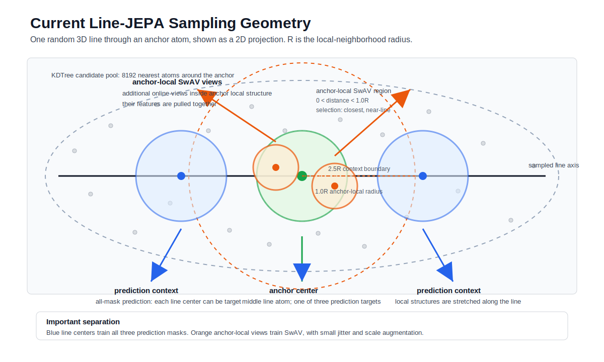
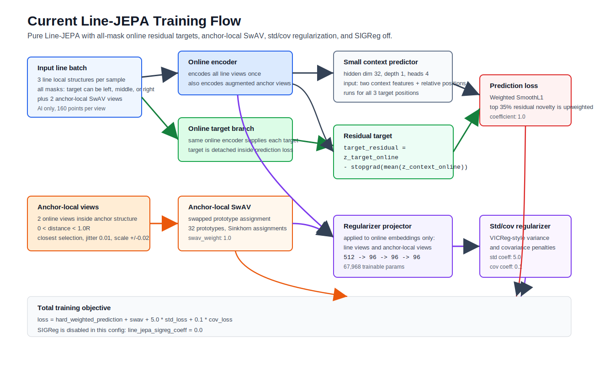

# Current Line-JEPA Method

These diagrams describe the current `line_jepa_static_pure.yaml` setup.

Metric definitions: [Line-JEPA metrics](line_jepa_metrics.md).

## Current Settings Shown

- Data: Al only, `datasets/Al/inherent_configurations_off`.
- Line task: `line_atoms: 3`; prediction uses all three mask positions.
- Candidate pool: `line_candidate_atoms: 8192`.
- Context separation: context local-structure centers are at least `2.5R` from the anchor center.
- Anchor-local SwAV views: additional centers inside the anchor local structure, `0 <= distance < 1.0R`, selected with `line_anchor_view_selection: closest`.
- Target encoder mode: online, not EMA.
- Prediction target: residual, `target_online - stopgrad(mean(two_context_online))`.
- Prediction weighting: top `35%` of feature-residual novelty in each batch gets higher prediction weight; low/high raw weights are `0.2/2.0` and normalized to mean `1`.
- Prediction view augmentation: point jitter `0.01` and isotropic scale jitter `+/-0.02`.
- Anchor-local SwAV: swapped prototype assignment on the two anchor-local views, `swav_num_prototypes: 32`, `swav_weight: 1.0`.
- Representation regularizer: VICReg-style std/cov on projected online line views and anchor views.
- SIGReg: off, `line_jepa_sigreg_coeff: 0.0`.
- Regularizer projector: `512 -> 96 -> 96 -> 96`, `67,968` trainable parameters.
